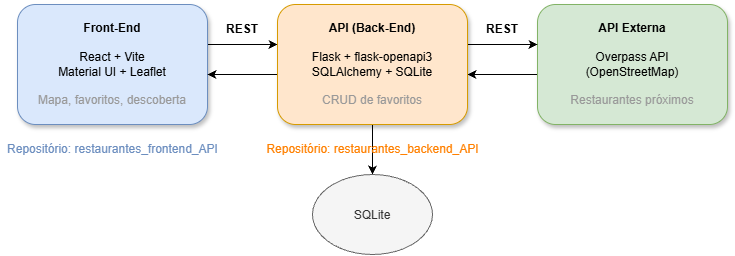

# Restaurantes Favoritos — Front-End

Interface web para salvar restaurantes favoritos com nota pessoal, comentários e tags, além de descobrir novos restaurantes próximos usando um mapa interativo. Projeto desenvolvido como MVP de arquitetura de software da pós-graduação, seguindo o **Cenário 1.1**: Interface → API (Back-End) → API Externa.

## Arquitetura

A interface se comunica via REST com a API principal ([restaurantes_backend_API](https://github.com/Carloshvf/ArquiSoftBackendMVP)), responsável por persistir os favoritos em SQLite e por consultar a Overpass API (OpenStreetMap) para trazer restaurantes próximos a uma coordenada.

## Tecnologias

- React + Vite
- Material UI
- React-Leaflet (mapas interativos)
- Fetch API nativa para comunicação REST

## API externa utilizada

- **Nome:** Overpass API (OpenStreetMap)
- **Documentação:** https://wiki.openstreetmap.org/wiki/Overpass_API
- **Licença/uso:** dados sob licença [ODbL](https://opendatacommons.org/licenses/odbl/), uso público e gratuito, sem necessidade de cadastro ou chave de API
- **Rota/endpoint consumido:** `POST https://overpass-api.de/api/interpreter`, com uma query em Overpass QL que filtra elementos `node`/`way` com a tag `amenity=restaurant` dentro de um raio a partir de uma coordenada (`around:raio,lat,lng`)
- **Como é consumida:** a chamada é feita pelo back-end ([restaurantes_backend_API](https://github.com/Carloshvf/ArquiSoftBackendMVP)), não diretamente pelo front — a interface consome a rota própria `GET /api/descobrir` da nossa API, que internamente consulta a Overpass e trata os dados antes de devolver, evitando qualquer redirecionamento do usuário para o serviço externo.

## Funcionalidades

- Listar, criar, editar e remover restaurantes favoritos (nome, endereço, categoria, nota, comentário, tags)
- Mapa interativo (Leaflet) para descobrir restaurantes próximos por clique ou geolocalização do navegador
- Favoritar diretamente pelo mapa, a partir dos resultados da busca

## Estrutura de pastas

restaurantes_frontend_API/
├── src/
│ ├── api/
│ │ └── favoritosService.js # comunicação com o backend
│ ├── components/
│ │ ├── FavoritosList.jsx
│ │ ├── FavoritoForm.jsx
│ │ └── MapaDescoberta.jsx
│ ├── App.jsx
│ └── main.jsx
├── docs/
│ └── arquitetura.png
├── Dockerfile
├── .dockerignore
├── package.json
└── README.md

## Como rodar localmente (sem Docker)

1. Instale as dependências:

npm install

2. Certifique-se de que o back-end ([restaurantes_backend_API](https://github.com/Carloshvf/ArquiSoftBackendMVP)) está rodando em `http://localhost:5000`.
3. Rode o servidor de desenvolvimento:

npm run dev

4. Acesse `http://localhost:5173`.

## Como rodar com Docker

1. Construa a imagem:

docker build -t restaurantes-frontend .

2. Rode o container:

docker run -p 8080:80 --name restaurantes-frontend-container restaurantes-frontend

3. Acesse `http://localhost:8080` (com o back-end também rodando, seja localmente ou em outro container).
